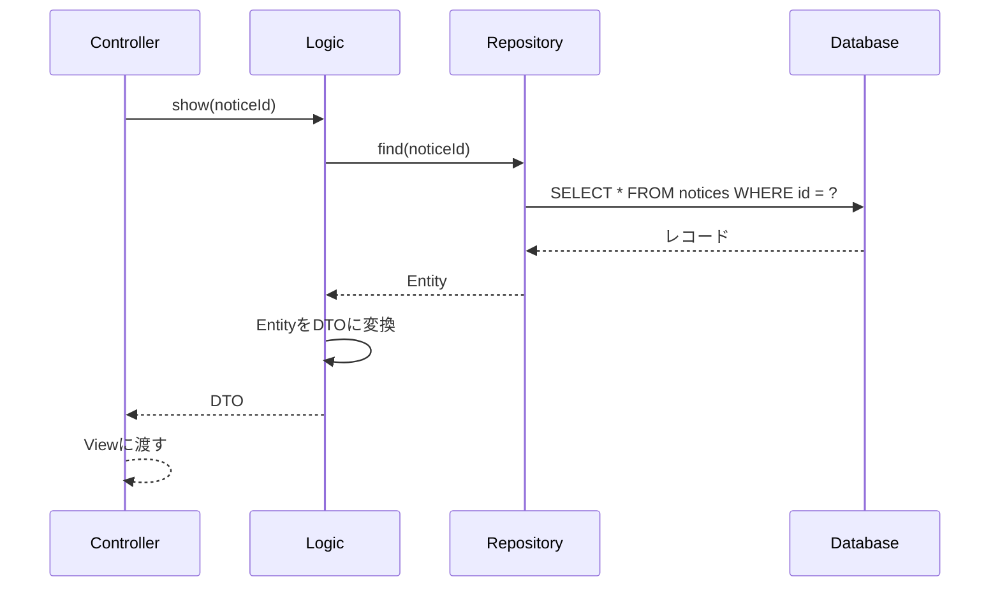

# アーキテクチャ設計

## レイヤー構成

```
[Controller]
    ↓ リクエストを受け取り、Logicに渡す
[Logic]
    ↓ ビジネスロジック（バリデーション・加工）
[Repository]
    ↓ DBアクセスのみ担当
[Entity]
    ↓ DBの1レコードをオブジェクトで表現
[DTO]
    Viewに渡すデータの入れ物
```

## 各レイヤーの役割と理由

### Controller
- リクエストを受け取ってLogicに渡し、結果をViewに返すだけ
- 処理をここに書かない理由: 可読性と責務の分離のため

### Logic
- ビジネスロジック（条件分岐・計算・バリデーション）を担当
- DBアクセスを直接書かない理由: Repositoryに集約することで変更に強くなる

### Repository
- DBアクセスのみ担当
- 集約する理由: DBの変更（MySQL→Redis等）があってもここだけ修正すればいい

### Entity
- DBの1レコードをそのままオブジェクトにしたもの
- DBの形をそのまま表現する

```php
$entity->id        // 1
$entity->office_id // 3
$entity->name      // 山田太郎
$entity->status    // 未対応
```

### DTO（Data Transfer Object）
- Viewに渡すために必要な形に整えた専用の箱
- 複数テーブルの値をまとめて1つのオブジェクトにする
- 型が決まっているので補完が効き、間違えにくい

```php
$dto->name        // 山田太郎
$dto->status      // 未対応
$dto->officeName  // 渋谷店 ← officesテーブルから
$dto->sentCount   // 3通   ← mail_logsから計算
```

**EntityとDTOの違い:**
- Entity = DBの形
- DTO = 画面の形

## データの流れ（例: 反響詳細画面）


