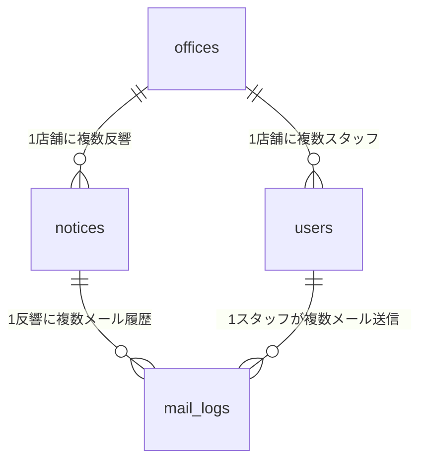

# DB設計

## テーブル一覧

### offices（店舗）

| カラム | 型 | NULL | 説明 |
|--------|----|------|------|
| id | bigint | NO | PK |
| name | varchar | NO | 店舗名 |
| tel | varchar | NO | 電話番号 |
| address | varchar | NO | 住所 |
| deleted_at | timestamp | YES | 論理削除 |
| created_at | timestamp | NO | |
| updated_at | timestamp | NO | |

---

### users（スタッフ）

| カラム | 型 | NULL | 説明 |
|--------|----|------|------|
| id | bigint | NO | PK |
| office_id | bigint | NO | FK → offices.id |
| name | varchar | NO | 氏名 |
| email | varchar | NO | メールアドレス |
| password | varchar | NO | パスワード |
| role | varchar | NO | member / admin / sysAdmin |
| deleted_at | timestamp | YES | 論理削除 |
| created_at | timestamp | NO | |
| updated_at | timestamp | NO | |

---

### notices（反響）

| カラム | 型 | NULL | 説明 |
|--------|----|------|------|
| id | bigint | NO | PK |
| office_id | bigint | NO | FK → offices.id |
| name | varchar | NO | 問い合わせ者名 |
| tel | varchar | YES | 電話番号 |
| email | varchar | YES | メールアドレス |
| title | varchar | NO | 件名 |
| body | text | NO | 問い合わせ内容 |
| source | varchar | NO | 流入元（SUUMO / HOME'S / 自社LP 等） |
| status | varchar | NO | 未対応 / 対応中 / 対応済 |
| created_at | timestamp | NO | |
| updated_at | timestamp | NO | |

---

### mail_logs（メール履歴）

| カラム | 型 | NULL | 説明 |
|--------|----|------|------|
| id | bigint | NO | PK |
| notice_id | bigint | NO | FK → notices.id |
| send_user_id | bigint | YES | FK → users.id（受信時はNULL） |
| type | varchar | NO | sent / received |
| title | varchar | NO | 件名 |
| body | text | NO | 本文 |
| created_at | timestamp | NO | |
| updated_at | timestamp | NO | |

---

## リレーション図

