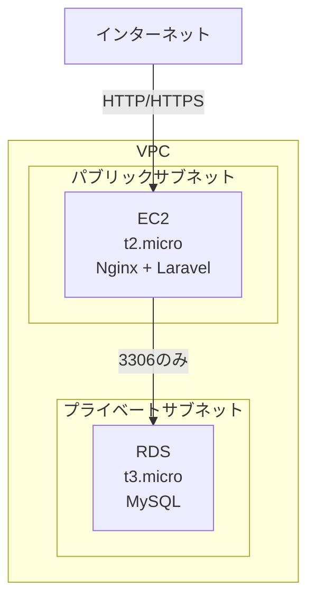

# インフラ構成

## 方針

- AWS を使用
- 低コスト・小規模構成
- ELBなし（コスト削減のためEC2に直接SSL証明書を置く）

## 使用サービス

| サービス | 詳細 | 月額目安 |
|----------|------|----------|
| VPC | 1つ | 無料 |
| EC2 | t2.micro（無料枠）/ 無料枠終了後はt3.micro推奨 | 無料〜$10 |
| RDS | t3.micro、MySQL | $15〜20 |
| セキュリティグループ | EC2用・RDS用 | 無料 |
| **合計** | | **$15〜30** |

## ネットワーク構成

## セキュリティグループ

### EC2用
| タイプ | ポート | 送信元 | 説明 |
|--------|--------|--------|------|
| HTTP | 80 | 0.0.0.0/0 | 全許可 |
| HTTPS | 443 | 0.0.0.0/0 | 全許可 |
| SSH | 22 | 自分のIPのみ | サーバー管理用 |

### RDS用
| タイプ | ポート | 送信元 | 説明 |
|--------|--------|--------|------|
| MySQL | 3306 | EC2のセキュリティグループ | EC2からのみ許可 |

## 今後追加を検討するサービス

- SQS（メール送信の非同期処理）
- Lambda（バッチ処理）
- API Gateway（API化する場合）
