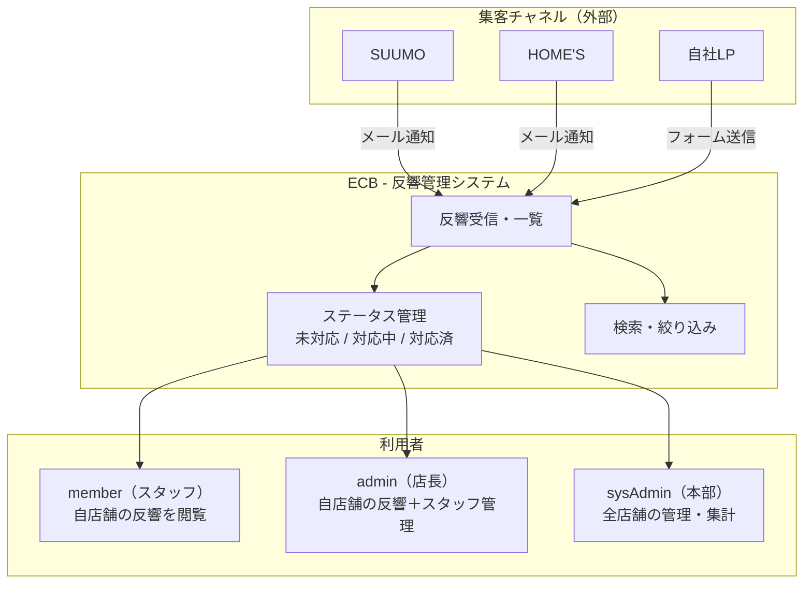

# システム概要

## 背景

田中工務店グループは関東に5店舗を持つ注文住宅会社。
各店舗がSUUMO・HOME'Sなどのポータルサイトと自社LPで集客している。

問い合わせが入ると各ポータルからメールが届くが、現状は店舗ごとにそのメールを見て対応しているだけ。

## 課題

- どの問い合わせが対応済みか共有できない
- 複数ポータルから同じ人が問い合わせてきても気づけない
- 店長は自分の店舗の状況を把握したいが、メールを全部見るしかない
- 本部は全店舗の問い合わせ数を把握できていない

## 解決したいこと

各店舗の問い合わせを一画面で管理・検索・確認できるシステム

---

## システム全体図

